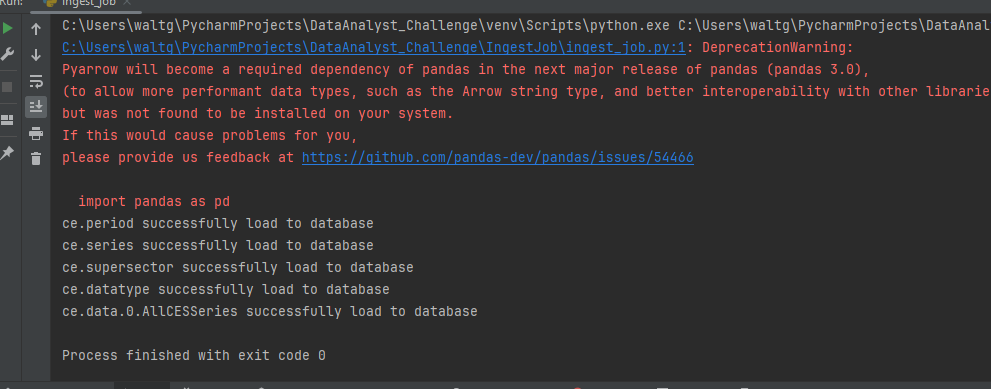
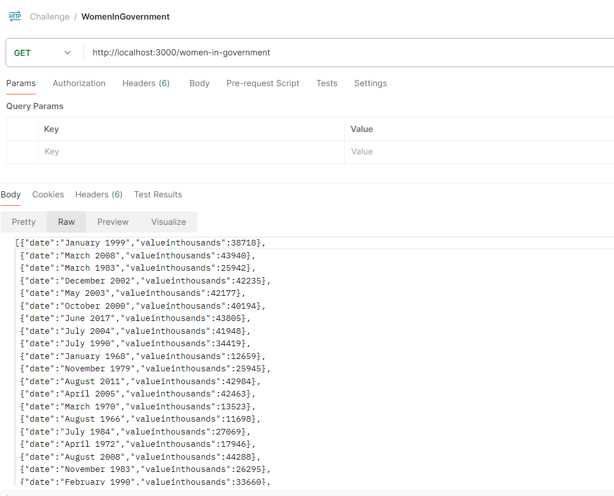
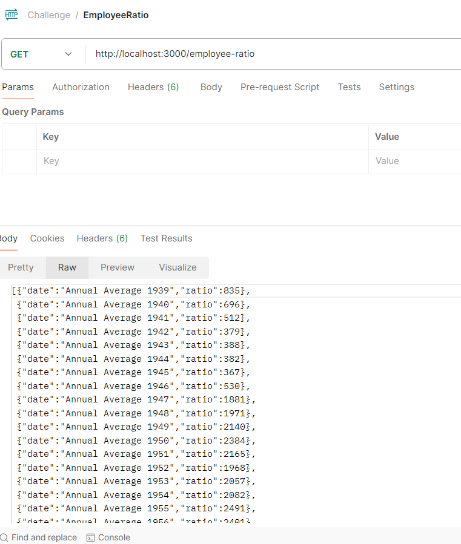
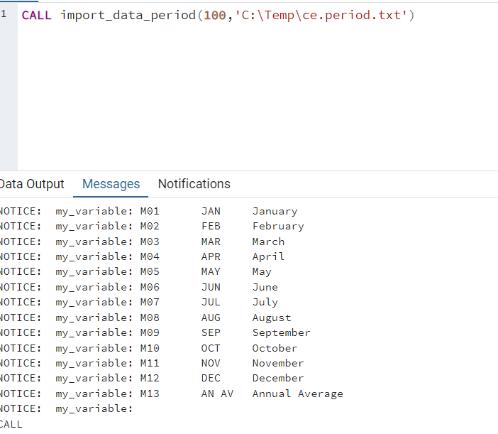

### This repositoy has two proposal solutions to address the challenge given:

#### 1. Ingest the data in the CSV files using python and pandas to load into Postgres database. 

This solution have the following structure  (ELT)


The python code consist in two main folders: 
* IngestJob: Which contains the main job to read and load the csv files from https://download.bls.gov/pub/time.series/ce/
* resources: This folder contains a constants configuration file to retrieve all the values used by the Python process.
* Additionally, there is a file named requirements.txt that contains the list of dependencies needed.

The repository also includes a docker-compose.yml file to create a custom container with the following components:
* An instance of PostgreSQL to store the data.
* Installation of pgAdmin for database management.
* Postrest connected to the PostgreSQL instance 

When ``docker compose up --build`` is executed docker will create all the containers defined in the yml
```docker-compose.yml``` it'll use the ```init.sql``` for the creation of database, tables and views
for the proces.

No parameters are needed to execute this process and if everything was set up correctly it will show the 
following message:



Moreover, you can check the execution by hitting the following 
endpoints with postman or another tool:

* http://localhost:3000/women-in-government


*http://localhost:3000/employee-ratio


#### 2. Ingest the data in the CSV files using Postgres Store Procedures (ELT).

 

This approach consists of 5 stored procedures, 
each of which loads a file into the database. 
These files are contained in the 'procedures' folder. 
This solution assumes that the files are already located in a local path.
Please remember to execute 'init.sql' in an instance of PostgreSQL
before executing the stored procedures.

##### Parameters of each stored procedure

    *chunk_size: Define the number of rows loaded in each iteration.
    *path: Local path of the file.




Side note: I couldn't develop the solution using pl/pyhon because I was facing some issues when I tried 
to execute code in postgres, and I wasn't able to resolve them.
